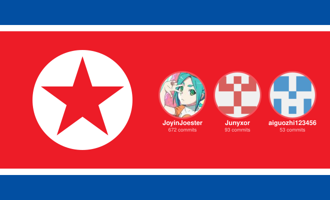

<h1 align="center">Monica 本地密码库</h1>

**中文** | [English](README_EN.md) | [日本語](README_JA.md) | [Tiếng Việt](README_VI.md) | [Русский](README_RU.md) | [黑羽川](README_Nya.md)

<strong>聚合 Bitwarden 与 KeePass 的本地优先密码库</strong>

Android / Browser · Local Vault · TOTP · WebDAV Backup

	友情链接：
	<a href="https://linux.do" title="Linux.do">
		
		Linux.do
	</a>

 

Monica 是一个聚合 **Bitwarden** 与 **KeePass** 的本地密码库（Local Vault）。
它以本地存储优先为核心，帮助你在 Android 与浏览器端统一管理账号密码、2FA、私密笔记与敏感附件。

官网入口: https://monica-pass.github.io/MonicaDocs/

> Monica for Windows 已归档。历史代码见: [Monica-for-Windows](https://github.com/JoyinJoester/Monica-for-Windows)
>
> Monica for Browser 已归档。新的 Monica Extension 正在重写开发中，敬请期待。
>
> 由于目前项目主要由我一人维护，时间与精力都比较有限，因此 Monica for Wear 暂时无法保持持续更新。现阶段我会将主要重心放在 Monica for Android 的功能完善、体验优化与稳定性维护上，也感谢大家的理解与支持。

---

## 用户先看

### Monica 适合谁
- 需要本地优先密码管理，不希望账号数据托管到第三方云。
- 既使用 Bitwarden，也维护 KeePass (`.kdbx`) 数据。
- 需要 Android 日常使用，同时在浏览器里完成自动填充。

### 你能得到什么
- 本地加密保险箱: 登录信息、银行卡、身份信息、私密笔记、附件。
- 双生态聚合: Android 端包含 Bitwarden API/同步能力与 KeePass (`.kdbx`) 读写能力。
- 可选同步与备份: 通过自有 WebDAV 基础设施实现跨设备数据流转。
- 内置 TOTP: 在同一应用内完成密码与二次验证码管理。

### MDBX 本地数据库格式
MDBX 是 Monica 正在推进的本地优先加密 vault 格式。它不是简单的密码表，而是围绕嵌套文件夹、附件、提交历史、冲突检测、tombstone 删除链路、快照恢复和 Tiga 安全模式设计的数据库格式。

如果你要在其他客户端接入 MDBX，请先读 [MDBX workspace 说明](mdbx/README.md) 和 [MDBX 客户端接入指南](mdbx/CLIENT_INTEGRATION_GUIDE.zh-CN.md)。完整格式规范在 [mdbx/docs](mdbx/docs/README.zh-CN.md)。

### 快速安装

Android:
1. 从 [Releases](https://github.com/Monica-Pass/Monica-for-Android/releases) 下载最新 APK。
2. 在 Android 8.0+ 设备安装并初始化主密码。

浏览器插件 (Chrome / Edge):
1. 在 `Monica for Browser` 目录构建插件。
2. 打开 `chrome://extensions/` 并启用开发者模式。
3. 选择“加载已解压的扩展程序”，导入 `dist` 目录。

### 已知限制
- 由于系统兼容性原因，Monica for Android 目前在部分小米 HyperOS 设备上无法创建通行密钥（Passkey）。可以尝试酷 U 提供的解决模块：[HyperMonica](https://github.com/Wuming155/HyperMonica)。

---

## Android 版本重点

### 核心功能
- 本地 Vault: 所有核心凭据本地加密存储。
- 聚合导入: 支持 KeePass 数据迁移与 Bitwarden 兼容接入。
- 智能检索: 按标题、域名、标签快速定位凭据。
- 生物识别解锁: 使用系统级生物识别能力提升安全与可用性。
- TOTP 管理: 统一存储并生成动态验证码。

### 实现说明（专业版）
- UI 层: Jetpack Compose + Material 3 + Navigation Compose。
- 数据层: Room（`PasswordDatabase`）+ DAO + Repository。
- 并发模型: Kotlin Coroutines + Flow。
- 依赖注入: Koin（应用启动于 `MonicaApplication`）。
- 安全能力: Android Keystore、EncryptedSharedPreferences、BiometricPrompt。
- 同步任务: WorkManager（`AutoBackupWorker`）用于自动 WebDAV 备份。
- 协议与集成: Retrofit + OkHttp（Bitwarden API）、kotpass（KeePass）、sardine-android（WebDAV）。

### 安全模型
- 加密算法: AES-256-GCM（认证加密）。
- 密钥派生: PBKDF2-HMAC-SHA256（高迭代参数）。
- 本地保护: 主密码哈希与安全配置由本地安全组件管理。
- 网络边界: 应用声明网络权限，主要用于 Bitwarden 联动与 WebDAV 备份/同步等在线能力。

---

## 赞助支持

如果 Monica 对你有帮助，欢迎支持持续开发与安全投入。

 
微信 / 支付宝扫码支持

 

  

你的支持将优先用于:
- 安全审计与加密方案强化。
- Android 体验优化与稳定性改进。
- 跨端功能统一与文档维护。

<!-- afdian-sponsors:start -->
### 爱发电鸣谢

感谢每一位支持 Monica 的朋友！

**本月打赏金额：¥40.00**

<table>
<tbody>
<tr><td align="center" width="120"> 1503384107 ¥180.00</td><td align="center" width="120"> 半夏微凉 ¥50.00</td><td align="center" width="120"> 一生 ¥30.00</td><td align="center" width="120"> 名字太长会有傻子跟着念吗 ¥30.00</td><td align="center" width="120"> 洛初 ¥15.00</td><td align="center" width="120"> Memory15 ¥10.00</td></tr>
<tr><td align="center" width="120"> 爱发电用户_70c34 ¥10.00</td><td align="center" width="120"> NovaX ¥10.00</td><td align="center" width="120"> 爱发电用户_rywF ¥10.00</td><td align="center" width="120"> 御坂07833号 ¥10.00</td><td align="center" width="120"> 爱发电用户_vR9n ¥10.00</td><td align="center" width="120"> 爱发电用户_ff493 ¥10.00</td></tr>
<tr><td align="center" width="120"> 爱发电用户_a991e ¥10.00</td><td align="center" width="120"> 爱发电用户_U9rq ¥10.00</td><td align="center" width="120"> 爱发电用户_d4f2c ¥10.00</td><td align="center" width="120"> 爱发电用户_edaa4 ¥10.00</td><td align="center" width="120"> 爱发电用户_e928c ¥6.00</td><td align="center" width="120"> 哇哦 ¥5.00</td></tr>
<tr><td align="center" width="120"> 爱发电用户_xj7t ¥5.00</td><td align="center" width="120"> Kiana Kaslana ¥5.00</td><td align="center" width="120"> 海之南 ¥5.00</td><td align="center" width="120"> 重逢海风 ¥5.00</td><td align="center" width="120"> yagaojun ¥5.00</td><td align="center" width="120"> 可恶 ¥5.00</td></tr>
<tr><td align="center" width="120"> 爱发电用户_97324 ¥5.00</td><td align="center" width="120"> Jursin ¥5.00</td><td align="center" width="120"> Memories white ¥5.00</td><td align="center" width="120"> 爱发电用户_hAKP ¥5.00</td><td align="center" width="120"> 森王 ¥5.00</td><td align="center" width="120"> 爱发电用户_43357 ¥5.00</td></tr>
<tr><td align="center" width="120"> 坏名字qwq ¥5.00</td><td align="center" width="120"> Draking ¥5.00</td><td align="center" width="120"> 希莉卡 ¥5.00</td><td align="center" width="120"> airem ¥5.00</td><td align="center" width="120"> Janson ¥5.00</td><td align="center" width="120"> 爱发电用户_0e739 ¥5.00</td></tr>
</tbody>
</table>
<!-- afdian-sponsors:end -->

---

## 开发者信息

### 项目分层（代码现状）
- `takagi/ru/monica/ui`: Compose 页面与组件。
- `takagi/ru/monica/data`: Room 实体、DAO、数据库迁移。
- `takagi/ru/monica/repository`: 数据访问封装。
- `takagi/ru/monica/security`: 加密、密钥与鉴权相关实现。
- `takagi/ru/monica/bitwarden`: API、加密、映射、同步与视图模型。
- `takagi/ru/monica/autofill`: 自动填充服务与流程。
- `takagi/ru/monica/passkey`: Android 14+ Credential Provider 相关实现。
- `takagi/ru/monica/workers`: 后台任务（如自动 WebDAV 备份）。
- `mdbx`: Monica MDBX 本地数据库格式的 Rust workspace 与客户端接入文档。

### 当前已使用的成熟组件（仓库可验证）
- Android UI: Jetpack Compose, Material 3, Navigation Compose。
- 数据与状态: Room, DataStore Preferences, ViewModel。
- 安全: Android Keystore, EncryptedSharedPreferences, BiometricPrompt。
- 网络与协议: Retrofit, OkHttp, Kotlinx Serialization。
- 同步与生态: sardine-android(WebDAV), kotpass(KeePass), Bitwarden API 对接。
- 异步与任务: Coroutines, Flow, WorkManager。
- 其他能力: CameraX + ML Kit（二维码扫描）, Credentials API（Passkey）。

### 构建与贡献
- Android Studio: 最新稳定版。
- JDK: 17+。
- Android 配置: `compileSdk 35`，`targetSdk 34`，`minSdk 26`（见 `Monica for Android/app/build.gradle`）。
- Android 构建基线: AGP `8.6.0`，Kotlin `2.0.21`，Compose BOM `2026.03.00`（Material3 跟随 BOM）。
- 版本信息以 `Monica for Android/gradle/libs.versions.toml` 与 `Monica for Android/app/build.gradle` 为准。
- 浏览器端技术栈: React + TypeScript + Vite（见 `Monica for Browser/package.json`）。
- 欢迎通过 Issue / PR 参与功能和安全改进。

---

## 致谢

Monica 的设计、兼容性适配与部分功能方向，受到了以下优秀开源项目和软件的启发与帮助：

- [Keyguard](https://github.com/AChep/keyguard-app) - Android 端密码管理器的交互设计与体验参考。
- [Bitwarden](https://bitwarden.com/) - 开源密码管理生态、Vault 模型与同步能力的重要参考。
- [KeePass](https://keepass.info/) - 本地密码库理念与 `.kdbx` 生态兼容的重要基础。
- [Stratum Auth](https://github.com/stratumauth/app) - 身份验证器体验、图标资源与相关兼容支持参考。
- [Steam Desktop Authenticator](https://github.com/Jessecar96/SteamDesktopAuthenticator) - Steam maFile 格式、Steam Guard 与交易确认兼容性的参考。
- [steamguard-cli](https://github.com/dyc3/steamguard-cli) - Steam Guard 登录、令牌迁移与确认协议实现的参考。
- [AnotherVaporAuth](https://github.com/freefrank/AnotherVaporAuth) - Steam 移动验证器、登录批准与确认流程体验的参考。

---

## Star History

---

## 贡献者

---

## 社区与支持

- Telegram 群组：[加入 Monica 社区](https://t.me/+IZUDLL-vWOA1Y2U1)

---

## 许可证

Copyright (c) 2025 JoyinJoester

Monica 基于 [GNU General Public License v3.0](LICENSE) 开源发布。

## 第三方图标标注

- 本项目本地打包了来自 [Stratum Auth app](https://github.com/stratumauth/app) 的图标资源（版本 [v1.4.0](https://github.com/stratumauth/app/releases/tag/v1.4.0)，目录 [icons](https://github.com/stratumauth/app/tree/v1.4.0/icons) / [extraicons](https://github.com/stratumauth/app/tree/v1.4.0/extraicons)，GPL-3.0）。
- 银行卡/支付卡图标来源：本地目录 [SVG Credit Card & Payment Icons](svg-credit-card-payment-icons-main)（Apache-2.0）。
- 品牌名称与 Logo 的商标权归各自权利人所有。
